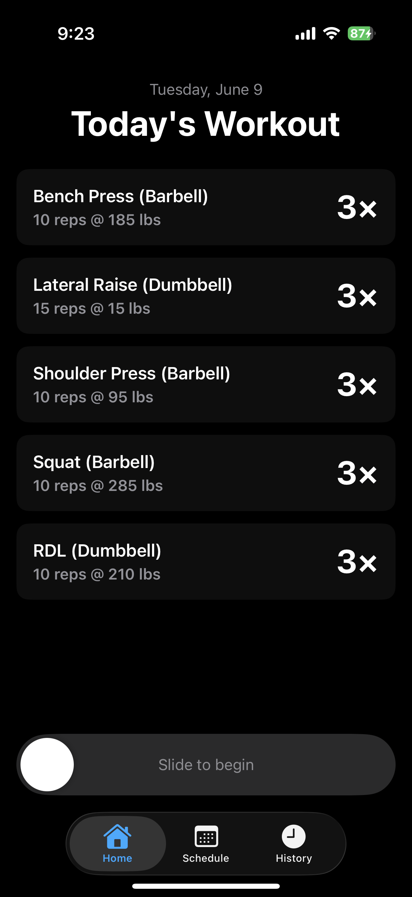
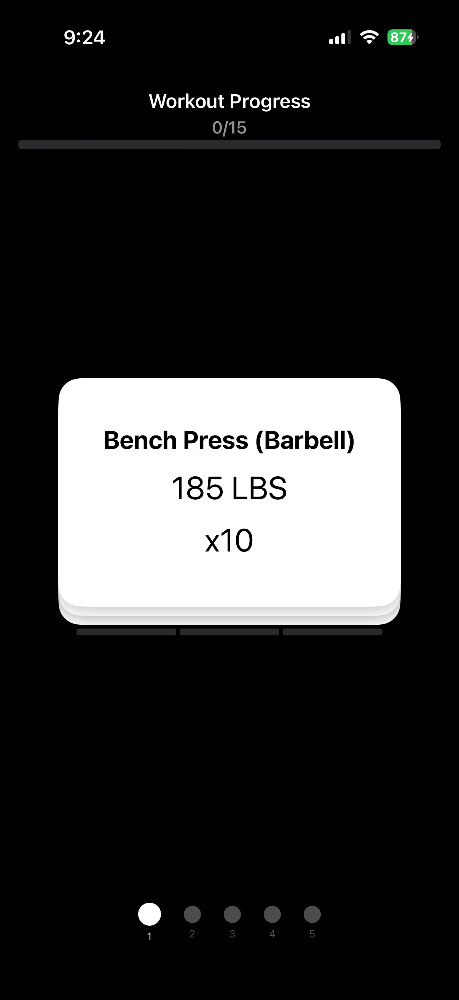
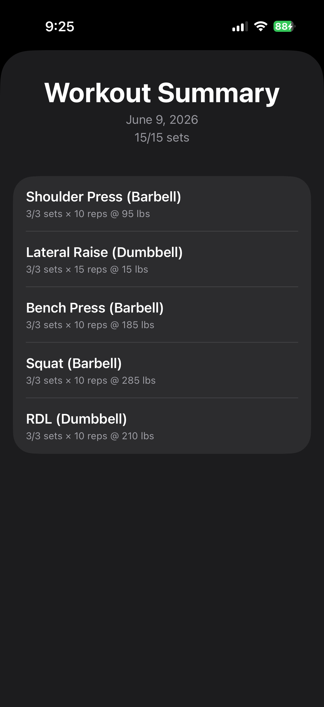
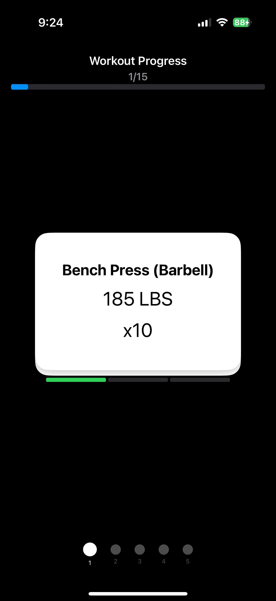
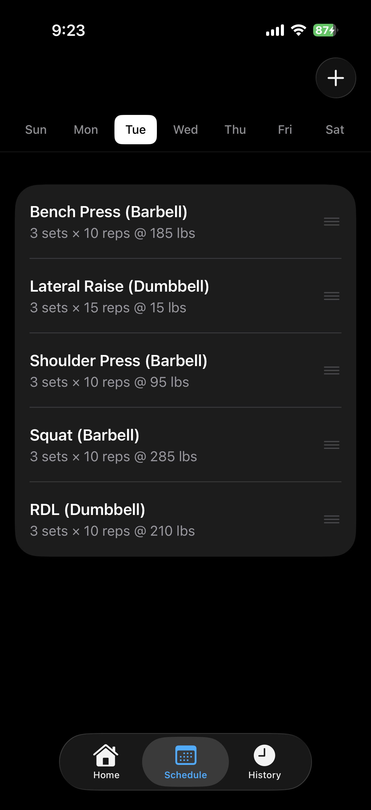
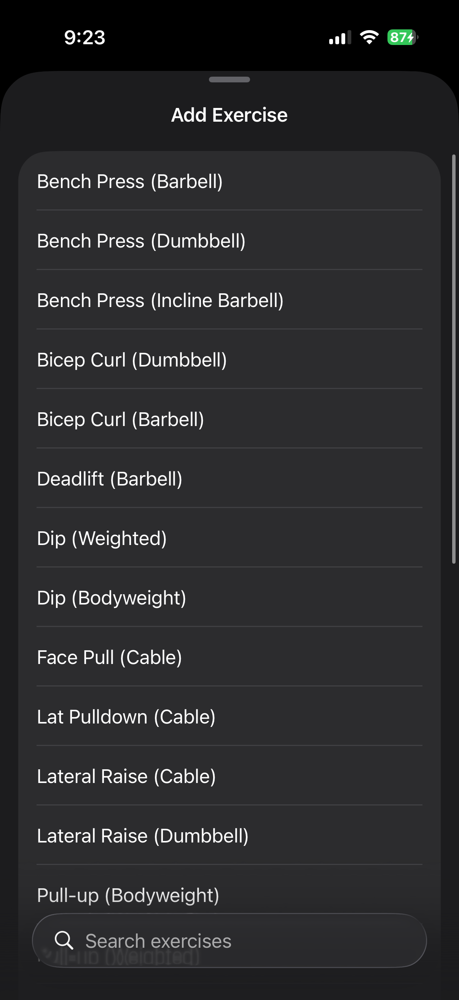
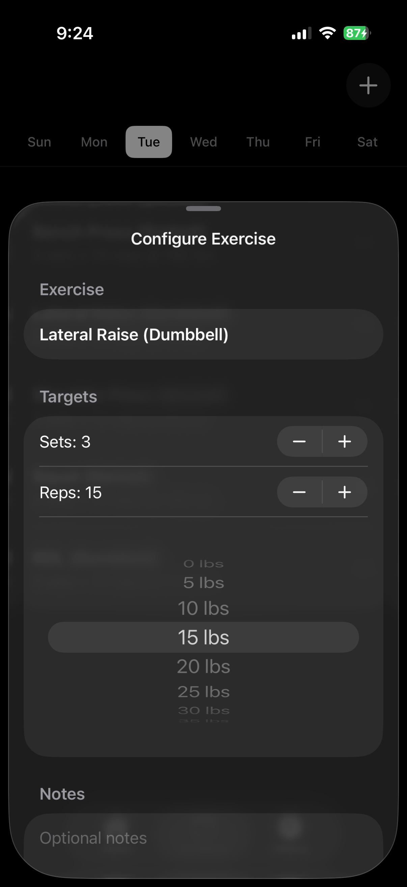
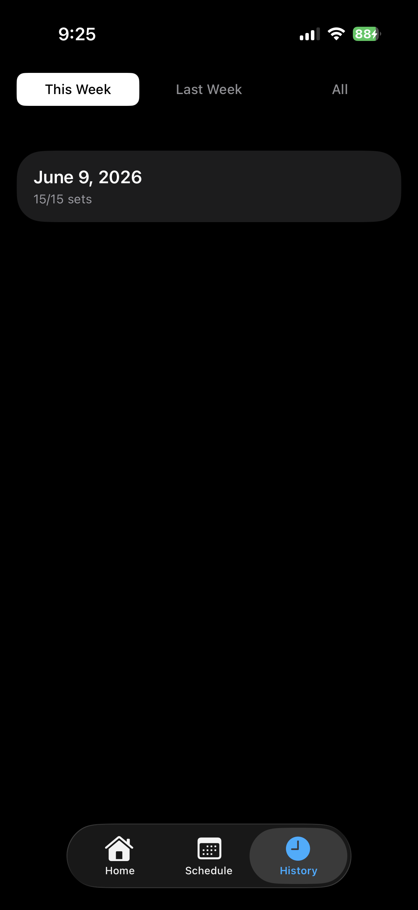

# RepDeck

**A workout tracker built around a deck of cards — one set per card, swipe to advance.**

RepDeck turns a training session into a focused, tactile flow: instead of scrolling a spreadsheet of sets, you move through your workout one card at a time. It's a native iOS app I built for my own training — and it now also powers [Continuum](https://sites.google.com/view/continuum-fitness/home), my 1:1 coaching practice, where it hands clients a structured program that feels less like data entry and more like just *training*.

  
  
  

---

## Why I built it

I've been strength training consistently for about five years, and I train in circuits — a set here, a set there, round and round — instead of parking at one station until I'm done. It keeps the session moving, but it has a flaw: when the next station's taken, I skip it and circle back, and somewhere in the shuffle I lose track of what I've actually finished.

The obvious fix is to tally sets in a notes app. I refused. I wanted something that was actually *fun* to use — and, honestly, an excuse to learn how to build an app and stretch some creative muscles.

So I went to the drawing board. The first sketches were the usual tables and spreadsheets, and they bored me instantly. Then I started thinking about how I'd track this *physically*. Index cards? That was the spark: don't list the sets — stack them. Each set is a card; complete it, and the next one's in your hand.

That's RepDeck. It started as a tool for me. The coaching integration — handing clients a program in the same format — came later, once I realized the thing I'd built for my own training worked just as well for theirs.

Two rules I wouldn't compromise on, both pulled straight from how I actually train:

1. **Starting a workout is deliberate.** You can't begin one by accident — that's what *slide to begin* is for. And once you're in, the tab bar disappears: you're locked into the session, not free to wander off mid-set.
2. **The execution engine has to support circuits.** You're never forced to empty one stack before starting another — you can move between exercises in any order, exactly like working around a busy gym floor.

## The signature: the deck

During a session, your workout is a stack of cards. Each card is one set. You complete it, swipe, and the next set is in front of you — with a progress bar up top (`1/15`) and per-exercise segments filling in as you go. Haptics and animations (not captured in stills) reinforce each completed set.

  
  

## How it works

**Set up a week.** Build a workout for any day from a searchable exercise library, then configure sets, reps, and weight per exercise. Drag to reorder.

  
  
  

**Train.** The home screen shows today's workout at a glance; slide to begin and you're in the deck.

**Track.** Completed sessions roll up into a summary and a history view filterable by week.

  

## Features

- Card-based set execution with swipe-to-advance and haptic feedback
- Per-day weekly programming with drag-to-reorder
- Searchable exercise library (barbell / dumbbell / cable / bodyweight variants)
- Per-exercise targets: sets, reps, weight, and notes
- Live workout progress tracking (overall and per-exercise)
- Post-workout summary and week-filterable history

## Tech

- **Language:** Swift
- **UI:** SwiftUI
- **Persistence:** SwiftData (local-only; `UUID`-keyed models preserve a CloudKit migration path)
- **Dependencies:** None — no third-party libraries
- **Architecture:** MV (Model-View) — SwiftUI views observe SwiftData models directly via `@Query`, with no separate ViewModel layer

## A few design decisions

- **Planned vs. actuals are separate models.** Scheduled targets are never mutated during a workout; completed sessions are logged independently. This keeps program integrity intact and makes intent-vs-actuals comparison possible later.
- **MV over MVVM, on purpose.** With SwiftData's `@Model` and SwiftUI's `@Query`, a ViewModel layer adds ceremony without payoff — views observe models directly, logic lives in the models and computed properties.
- **Built the gestures from scratch.** The slide-to-begin control and the swipe-to-complete card stack are custom — no gesture libraries.

## Where it's headed

The MVP loop is done; from here the roadmap splits two ways: a standalone execution companion anyone can program and use solo, and a coached version that arrives pre-loaded with a custom program from a consultation and feeds training analytics back to the coach.

---

*Built solo. The card metaphor, the gesture model, and every screen here are mine end to end.*
